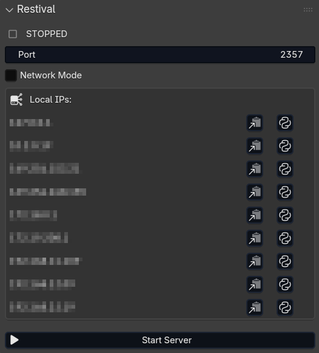
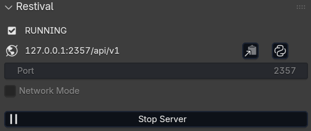

# Restival

Restival is a Blender addon that exposes your scene as a live REST API. It lets local models, external tools, and AI agents inspect objects, meshes, and scene data over HTTP without touching Blender's UI.

I built it because small models can often understand REST APIs more reliably than complex local MCP setups. In Blender, MCP-based workflows can add friction, create stale connections, and raise security concerns when arbitrary Python execution is involved. Restival keeps things simple. It is one addon, mostly read-only, with a narrow POST path for creating reviewable text scripts in Blender.

<p align="center">
  
  
</p>

## Features

- REST API for live Blender scene data (read + limited write)
- Works well with local models, tools, and AI agents
- Inspect scenes, objects, meshes, and file metadata over HTTP
- Create Python scripts in Blender's text editor via POST
- List and read Blender text datablocks through `/api/v1/texts`
- Validate JSON bodies and return standard error envelopes
- Generic `bpy.data` traversal for deeper inspection
- Simple setup inside Blender with no extra MCP-style wiring
- Built-in UI panel to start and stop the server
- Shows the active API URL and local IPs in the addon UI
- Copy-ready to use curl URL and agent prompt actions from the panel

## Install

Blender 4.2 or newer is required.

1. Download this repo as a ZIP or package it as a Blender addon.
2. In Blender, go to `Edit > Preferences > Add-ons`.
3. Click `Install from Disk` and select the ZIP.
4. Enable `Restival`.

## Use

1. Open Blender.
2. Go to `View3D > Sidebar > Restival`.
3. Set the port if needed. Default is `2357`.
4. Leave Network Mode off for localhost only, or enable it to expose the API on your local network.
5. Click `Start Server`.

Base URL by default:

```text
http://127.0.0.1:2357/api/v1
```

Most endpoints are `GET` only. The text editor API also supports `POST /api/v1/texts` to create scripts that users can review and run manually.

## Text editor API

Restival can expose Blender's text editor datablocks:

- `GET /api/v1/texts` lists text files in `bpy.data.texts`
- `GET /api/v1/texts/{name}` returns text metadata and content
- `POST /api/v1/texts` creates a new text file from a JSON body

POST body:

```json
{
  "name": "my_script.py",
  "content": "import bpy\nprint('Hello Blender!')\n"
}
```

`name` is required. `content` defaults to an empty string. Duplicate names and invalid JSON return the normal Restival error envelope.

## Examples

```bash
curl -s http://127.0.0.1:2357/api/v1/health
curl -s http://127.0.0.1:2357/api/v1/scenes
curl -s http://127.0.0.1:2357/api/v1/scenes/Scene/objects
curl -s http://127.0.0.1:2357/api/v1/scenes/Scene/objects/Cube
curl -s http://127.0.0.1:2357/api/v1/scenes/Scene/objects/Cube/mesh
curl -s http://127.0.0.1:2357/api/v1/data/materials

# Create a Python script in Blender's text editor
curl -X POST http://127.0.0.1:2357/api/v1/texts \
  -H "Content-Type: application/json" \
  -d '{"name": "my_script.py", "content": "import bpy\nprint(\"Hello Blender!\")\n"}'
```

If you want the API to describe itself first:

```bash
curl -s http://127.0.0.1:2357/api/v1
```
