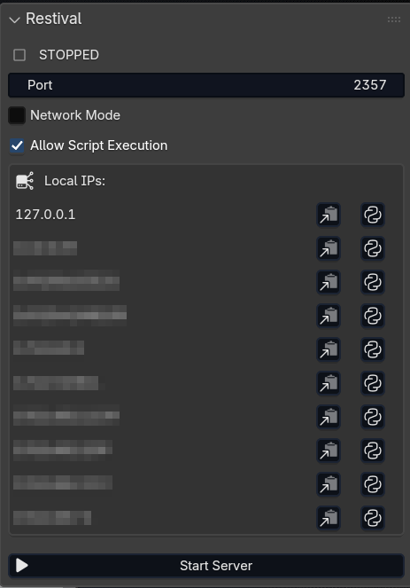
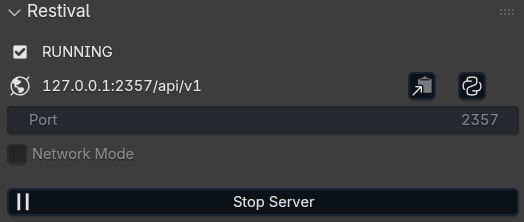
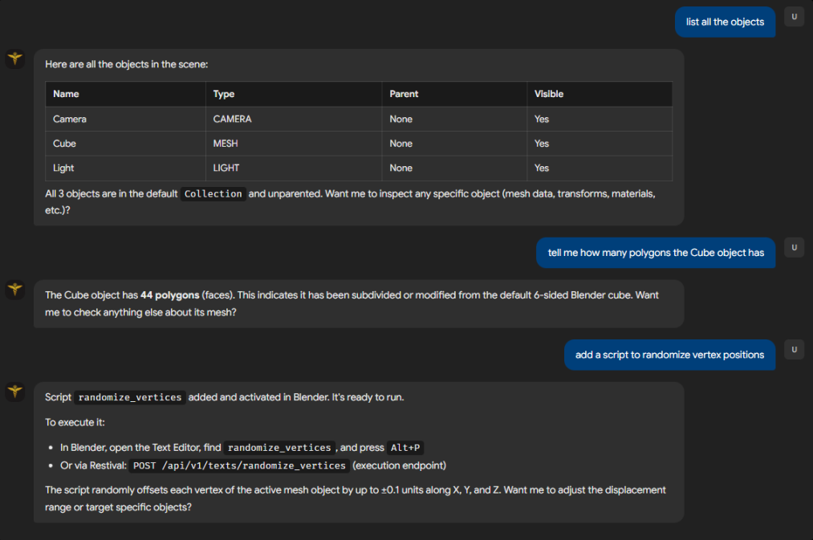

# Restival

Restival is a Blender addon that exposes your scene as a live REST API. It lets local models, external tools, and AI agents inspect objects, meshes, and scene data over HTTP, create and execute Python scripts inside Blender, and query the full `bpy.data` graph without touching Blender's UI.

I built it because small models can often understand REST APIs more reliably than complex local MCP setups. In Blender, MCP-based workflows can add friction, create stale connections, and raise security concerns when arbitrary Python execution is involved. Restival keeps things simple: one addon, a clear read/write boundary, and an explicit opt-in toggle for script execution.

<p align="center">
  
  
  
</p>

## Features

- REST API for live Blender scene data (read + write)
- Works with local models, tools, and AI agents
- Inspect scenes, objects, meshes, and file metadata over HTTP
- Create or replace Python scripts in Blender's text editor via POST
- Execute scripts remotely via `POST /api/v1/texts/{name}/run` — opt-in, off by default
- Script execution gated behind an explicit **Allow Script Execution** toggle in the N-panel
- `GET /api/v1/health` exposes `script_execution_allowed` so agents can check before attempting a run
- List and read Blender text datablocks through `/api/v1/texts`
- Generic `bpy.data` traversal for deeper inspection
- Validate JSON bodies and return standard error envelopes
- Simple setup inside Blender with no extra MCP-style wiring
- Built-in UI panel to start and stop the server
- Shows the active API URL and local IPs in the addon UI
- Copy-ready curl URL and agent prompt actions from the panel

## Install

Blender 4.2 or newer is required.

1. Download this repo as a ZIP or package it as a Blender addon.
2. In Blender, go to `Edit > Preferences > Add-ons`.
3. Click `Install from Disk` and select the ZIP.
4. Enable `Restival`.

## Use

1. Open Blender.
2. Go to `View3D > Sidebar > Restival`.
3. Set the port if needed. Default is `2357`.
4. Leave Network Mode off for localhost only, or enable it to expose the API on your local network.
5. Click `Start Server`.

To allow agents to execute scripts remotely, enable **Allow Script Execution** in the same panel. It is off by default.

Base URL by default:

```text
http://127.0.0.1:2357/api/v1
```

## Text editor API

Restival exposes Blender's text editor datablocks for reading, writing, and executing scripts:

- `GET /api/v1/texts` — list all text files in `bpy.data.texts`
- `GET /api/v1/texts/{name}` — return text metadata and content
- `POST /api/v1/texts` — create a new text block or replace the full content of an existing one
- `POST /api/v1/texts/{name}/run` — execute a text block on Blender's main thread (**requires Allow Script Execution to be enabled**)

### Creating a script

POST body:

```json
{
  "name": "my_script.py",
  "content": "import bpy\nprint('Hello Blender!')\n"
}
```

`name` is required. `content` defaults to an empty string. If a text block with the same name already exists, its full content is replaced.

### Executing a script

Script execution is **disabled by default**. Enable the **Allow Script Execution** toggle in the Restival N-panel before using the run endpoint.

Agents should check `script_execution_allowed` in `GET /api/v1/health` before attempting a run. If the toggle is off, the run endpoint returns `400 BAD_REQUEST` and the script does not execute.

The run endpoint returns `stdout`, `stderr`, `ok`, and `error` (a full traceback string if the script raised an exception).

**Agent workflow:**

```bash
# 1. Check execution is allowed
curl -s http://127.0.0.1:2357/api/v1/health

# 2. Write the script
curl -s -X POST http://127.0.0.1:2357/api/v1/texts \
  -H "Content-Type: application/json" \
  -d '{"name": "agent_script.py", "content": "import bpy\nprint(bpy.context.scene.name)\n"}'

# 3. Execute it
curl -s -X POST http://127.0.0.1:2357/api/v1/texts/agent_script.py/run
```

## Examples

```bash
curl -s http://127.0.0.1:2357/api/v1/health
curl -s http://127.0.0.1:2357/api/v1/scenes
curl -s http://127.0.0.1:2357/api/v1/scenes/Scene/objects
curl -s http://127.0.0.1:2357/api/v1/scenes/Scene/objects/Cube
curl -s http://127.0.0.1:2357/api/v1/scenes/Scene/objects/Cube/mesh
curl -s http://127.0.0.1:2357/api/v1/data/materials
```

If you want the API to describe itself first:

```bash
curl -s http://127.0.0.1:2357/api/v1
```
